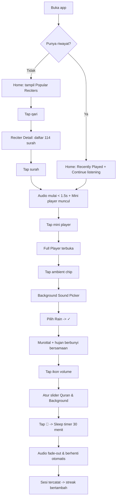
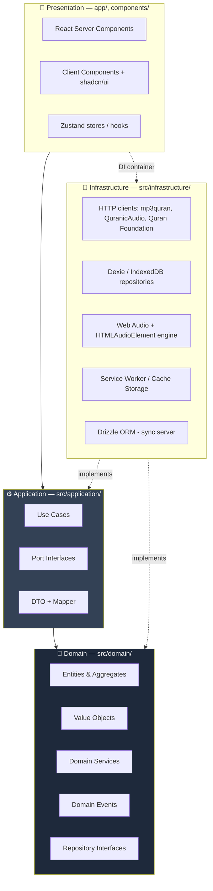
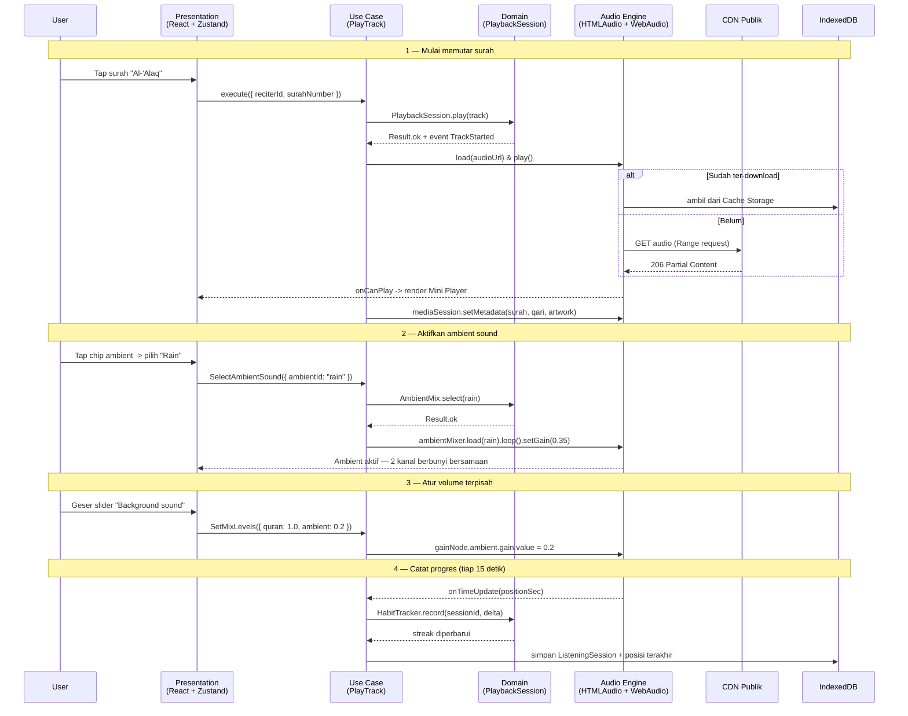
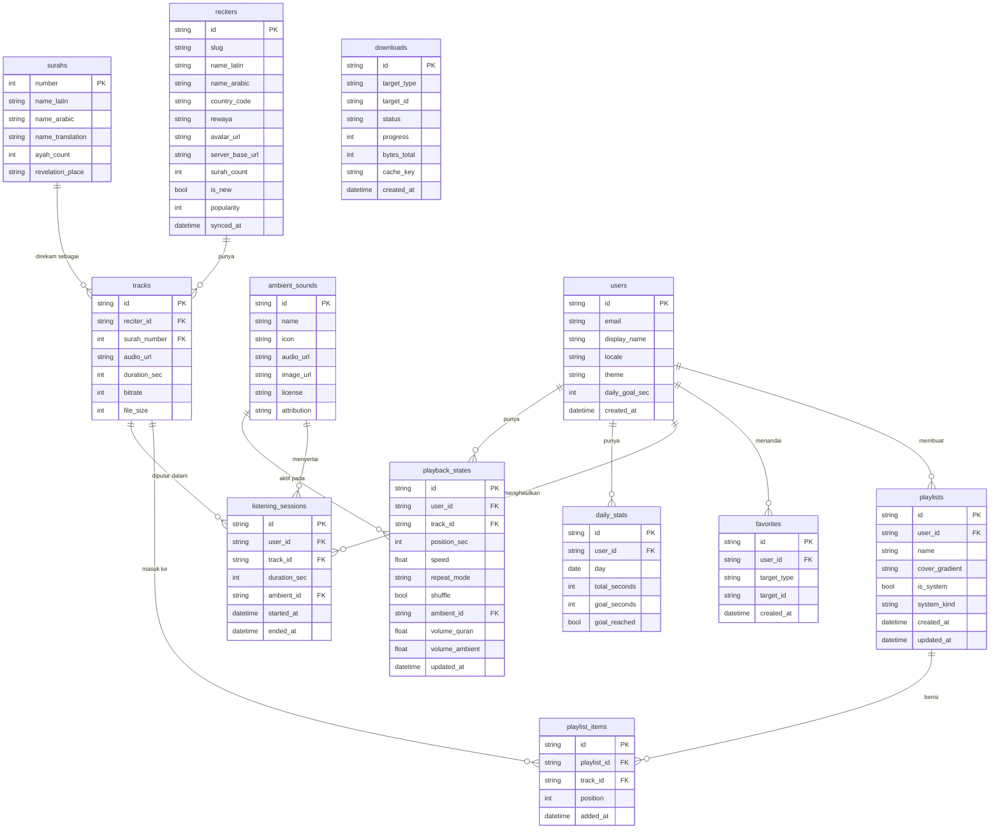

# PRD — Quran Audio Player (Quranify-like, Free Forever)

> **Codename:** `quranify-clone`
> **Platform:** Web App (Next.js) — **Mobile First**, installable sebagai PWA
> **Arsitektur:** Clean Architecture + Domain Driven Design
> **Model bisnis:** 100% gratis, semua fitur terbuka (no paywall, no ads), donasi opsional

---

## 1. Overview

### 1.1 Latar Belakang
Aplikasi pemutar audio Al-Qur'an yang ada saat ini (contoh: Quranify) menawarkan pengalaman mendengar Al-Qur'an ala Spotify — daftar qari, playlist bertema, *background nature sound*, sleep timer, dan statistik kebiasaan mendengar. Masalahnya: fitur paling bernilai (semua background sound, download offline, tafsir/lyrics, kontrol audio lanjutan, insights) dikunci di balik langganan premium (Rp 99rb/bulan atau Rp 399rb/tahun).

Padahal seluruh materi inti — rekaman murottal dari para qari dan teks Al-Qur'an — tersedia bebas dari CDN publik dan API terbuka. Yang dijual sebenarnya adalah *pengalaman*, bukan konten.

### 1.2 Tujuan
Membangun **web app mobile-first yang memberikan seluruh pengalaman tersebut secara gratis dan tanpa iklan**, dengan tiga pembeda utama:

1. **Semua fitur terbuka sejak detik pertama.** Tidak ada tier, tidak ada trial, tidak ada fitur terkunci. Monetisasi hanya lewat donasi sukarela.
2. **Audio mixing dua kanal.** Murottal + ambient sound (hujan, api, ombak, angin, jangkrik) diputar bersamaan dengan slider volume terpisah — inti dari *listening experience*.
3. **Zero-install.** Buka lewat browser, bisa di-*install* ke home screen sebagai PWA. Tidak perlu App Store, tidak perlu akun untuk mulai mendengar.

### 1.3 Non-Tujuan (Out of Scope MVP)
- Membaca Al-Qur'an sebagai mushaf lengkap dengan navigasi halaman (fokus kita **audio-first**, teks hanya sebagai *lyrics* pendamping)
- Fitur sosial (komentar, follow, share playlist antar-user)
- Podcast / audiobook Islami (roadmap fase 3)
- Native app iOS/Android (PWA dulu; wrapper Capacitor jadi opsi fase 3)
- Hafalan/muraja'ah dengan speech recognition

### 1.4 Target Pengguna

| Persona | Kebutuhan Utama | Fitur Kunci |
|---------|-----------------|-------------|
| **Pekerja/Mahasiswa** | Murottal sebagai latar saat kerja/belajar | Playlist *Focus & Work*, ambient sound, background playback |
| **Pendengar sebelum tidur** | Ketenangan, auto-mati | *Sleep Mode*, sleep timer, dimmed UI |
| **Pencari qari favorit** | Eksplorasi bacaan berbagai qari | Direktori qari, filter negara, favorit |
| **Pembangun kebiasaan** | Konsistensi harian mendengar | Streak, target harian, insights |
| **Pengguna kuota terbatas** | Dengar tanpa internet | Download offline per-surah, download manager |

---

## 2. Requirements

### 2.1 Functional Requirements (High Level)

| ID | Requirement |
|----|-------------|
| **FR-01** | Pengguna dapat memutar seluruh 114 surah dari **minimal 50 qari** tanpa login dan tanpa batasan apa pun. |
| **FR-02** | Pengguna dapat memutar **background ambient sound** bersamaan dengan murottal, dengan **dua slider volume independen**. |
| **FR-03** | Audio terus berjalan saat pengguna berpindah halaman di dalam app (*persistent player*), dan tetap berjalan saat layar terkunci selama OS mengizinkan. |
| **FR-04** | Pengguna dapat menandai surah/qari sebagai favorit, membuat playlist sendiri, dan mengakses playlist kurasi bertema. |
| **FR-05** | Pengguna dapat men-download surah dan ambient sound untuk diputar **offline**. |
| **FR-06** | Sistem mencatat riwayat mendengar dan menampilkan **streak, menit per minggu, rekor, dan target harian**. |
| **FR-07** | Pengguna dapat mencari qari, surah, dan playlist dari satu entry point pencarian global. |
| **FR-08** | Pengguna dapat melihat **teks Arab + terjemahan (lyrics)** yang tersinkron dengan posisi audio saat memutar. |
| **FR-09** | Kontrol pemutaran mencakup: play/pause, prev/next, seek, kecepatan (0.5x–2x), shuffle, repeat (off/all/one), sleep timer, dan antrean (*queue*) yang bisa diurutkan ulang. |
| **FR-10** | Data pengguna (favorit, playlist, progres, statistik) tersimpan **lokal secara default**; sinkronisasi antar-perangkat bersifat **opsional** lewat login. |

### 2.2 Non-Functional Requirements

| Kategori | Target |
|----------|--------|
| **Mobile First** | Semua layar dirancang pada breakpoint 390px terlebih dahulu. Desktop = adaptasi (max-width container + sidebar), bukan sebaliknya. |
| **Performa** | LCP < 2.0s di 4G. Time-to-first-audio (tap play → suara keluar) < 1.5s. Bundle JS awal < 180KB gzip. |
| **Aksesibilitas** | Target sentuh min. 44×44px. Kontras WCAG AA. Navigasi keyboard penuh di desktop. `prefers-reduced-motion` dihormati. |
| **Offline** | App shell + data qari/surah + audio yang sudah di-download harus fungsional tanpa jaringan. |
| **Biaya operasional** | Mendekati nol: audio **di-stream langsung dari CDN publik**, tidak di-*rehost*, tidak lewat proxy server kita. |
| **Privasi** | Tanpa tracker pihak ketiga. Analitik self-hosted/anonim. Data mendengar tidak pernah dikirim ke server tanpa persetujuan eksplisit. |
| **Internasionalisasi** | i18n sejak hari pertama: **ID, EN, AR** (MVP). Dukungan RTL penuh untuk Arab. |
| **Kompatibilitas** | iOS Safari 16+, Chrome Android 110+, Chrome/Edge/Safari desktop terbaru. |

### 2.3 Content & Licensing Requirements
- Audio murottal **hanya** dari sumber publik yang mengizinkan hotlink/redistribusi (lihat §9).
- Ambient sound **wajib CC0** atau public domain — bukan CC BY-NC, bukan Pixabay License (karena Pixabay melarang distribusi audio secara *standalone*, sementara ambient pack di app kita mendekati kasus itu).
- File `CREDITS.md` publik mencantumkan seluruh sumber audio, teks, dan lisensinya.

---

## 3. Core Features

Fitur disusun berdasarkan layar. Setiap layar merujuk ke referensi UI di `referensi/`.

### 3.1 Home (`/`)
Beranda personal, isinya berubah mengikuti kebiasaan pengguna.

- **Announcement banner** — kartu tap-able di paling atas (contoh: "3 qari baru ditambahkan").
- **Recently Played** — avatar qari besar + judul + tombol pil **"Continue listening"** yang melanjutkan tepat di detik terakhir berhenti.
- **Your Favourites** — carousel horizontal avatar bulat qari favorit + "See all".
- **New Reciters** — carousel dengan badge `NEW` hijau.
- **Popular / Top Reciters** — carousel berdasarkan jumlah putar global (atau kurasi statis bila analitik belum ada).
- **Insights card** — ringkasan streak & target harian (§3.7), langsung di beranda.
- Header: judul "Home" + tombol **Insights** (ikon bar chart). *Tidak ada tombol "Premium"* — digantikan tombol **♥ Support** yang membuka halaman donasi.

### 3.2 Reciters (`/reciters`)
Direktori qari.

- **Search bar** sticky di atas ("Search reciters") dengan debounce 250ms.
- **Top Reciters — This month** — kartu highlight dengan 3 avatar bertumpuk.
- **Your Favourites**, **New Reciters** — carousel.
- **Grup berdasarkan negara** — "From Kazakhstan", "From Saudi Arabia", dst. Otomatis dari metadata negara qari.
- **Reciter Detail** (`/reciters/[slug]`):
  - Hero: foto, nama (Arab + latin), negara, riwayat bacaan (*rewaya*: Hafs 'an 'Asim, Warsh, dll), jumlah surah tersedia.
  - Tombol **Play All** & **Shuffle**.
  - Daftar 114 surah: nomor, nama latin, nama Arab, arti, durasi, ikon status download.
  - Tombol favorit qari.

### 3.3 Playlists (`/playlists`)
Grid 2 kolom kartu gradien.

- **Playlist sistem:** Favourites (⭐), Focus & Work, Most Beautiful Recitations, Sleep Mode, Duaa & Ruqia, Emotional Recitations.
- **Special sets by reciter:** kartu "Special set by [Nama Qari]" — kurasi surah pilihan dari satu qari.
- **Playlist buatan pengguna:** buat, ubah nama, ubah urutan (drag), hapus.
- **Playlist Detail** (`/playlists/[id]`): header gradien, jumlah track & total durasi, Play/Shuffle, daftar track dengan drag-reorder dan swipe-to-remove.

### 3.4 Player (Full Screen) — **fitur inti**
Dibuka dari mini player, tampil sebagai *drawer* full-screen yang bisa ditarik ke bawah untuk ditutup.

- **Background image** ambient full-bleed yang **berubah mengikuti ambient sound aktif** (hujan → pegunungan berkabut, api → perapian, ombak → pantai). Gambar CC0, di-preload, dengan overlay gradien gelap agar teks tetap terbaca.
- **Ambient chip** di atas tengah (contoh: `🌧 Rain`) — tap membuka Background Sound Picker (§3.5).
- **Track info**: avatar qari, nama surah, nama qari, tombol **favorit (★)**.
- **Transport controls**: `1x` (speed), ⏪ prev, ▶ play/pause besar, ⏩ next, 🌙 sleep timer.
- **Progress bar** dengan waktu berjalan & sisa waktu (`-0:04`), *scrubbing* presisi dengan haptic feedback.
- **Toolbar bawah — 4 aksi:**
  | Ikon | Fungsi |
  |------|--------|
  | 🔊 Volume | Buka **dual volume mixer**: slider *Quran* dan slider *Background sound* terpisah |
  | ق Lyrics | Panel teks Arab + terjemahan, auto-scroll & highlight ayat aktif |
  | ᯤ Cast | AirPlay / Google Cast (via Remote Playback API bila tersedia) |
  | ☰ Queue | Panel **Continue Playing**: shuffle, repeat, search dalam antrean, drag-reorder |

- **Sleep timer**: 5 / 10 / 15 / 30 / 45 / 60 menit, atau "akhir surah ini". Fade-out 20 detik terakhir.
- **Speed control**: 0.5x, 0.75x, 1x, 1.25x, 1.5x, 2x — dengan *pitch preservation*.

### 3.5 Background Sound Picker — **pembeda utama**
Bottom sheet, grid 3 kolom, ikon monokrom.

- **Katalog MVP (15):** No sounds, Rain, Birds, Fire, Wave, Wind, Cat, Owl, River, Whale, Crickets, Thunder Storm, Thunder, Train, Night Forest.
- **Semua tersedia gratis** — tidak ada gembok. Ikon ⬇ hanya menandakan "belum tersimpan offline", bukan "terkunci".
- Search bar untuk filter cepat.
- **Multi-select (v1.1):** campur hingga 3 ambient sekaligus dengan volume masing-masing (mode "Mixer").
- Semua ambient adalah **seamless loop** dan diputar via Web Audio API (bukan `<audio>`) supaya loop-nya benar-benar mulus tanpa jeda.
- Volume ambient default: 35% dari volume murottal.

### 3.6 Search (`/search`)
FAB pencarian mengambang di kanan bawah, di sebelah bottom nav.

- Satu input, hasil ter-*grouped*: **Reciters**, **Surahs**, **Playlists**, **Ambient sounds**.
- Pencarian surah menerima: nomor (`96`), nama latin (`Al-Alaq`), nama Arab (`العلق`), arti (`The Clot` / `Segumpal Darah`), dan typo-tolerant (fuzzy).
- Riwayat pencarian tersimpan lokal, bisa dihapus.

### 3.7 Insights (`/insights`)
Statistik kebiasaan mendengar — **gratis**, tidak seperti aslinya.

- Tiga metrik atas: 🔥 **Streak** (hari beruntun), 📅 **This week** (menit), 🏅 **Record** (streak terpanjang).
- **Ring progres "Today's listening"** dengan tombol **Adjust Goal** (default 15 menit/hari).
- **Baris 7 hari** (Mon–Sun) dengan tanda ✓ pada hari tercapai.
- Tombol **Continue listening**.
- Detail: total jam sepanjang masa, qari terbanyak didengar, surah terbanyak didengar, distribusi jam mendengar (heatmap).
- Aturan pencatatan: sesi dihitung bila **≥60 detik** audio benar-benar diputar; posisi & durasi disimpan lokal, di-*flush* ke storage tiap 15 detik dan saat `visibilitychange`.

### 3.8 Persistent Mini Player
Melayang di atas bottom nav, ada di **semua** layar.

- Thumbnail qari, `96. Al-'Alaq (العلق)`, nama qari (marquee bila kepanjangan), ▶/⏸, ⏩.
- Tap → buka full player. Swipe ke bawah → sembunyikan (audio tetap jalan). Swipe ke kiri/kanan → next/prev track.
- Progress bar tipis di tepi atas mini player.

### 3.9 Bottom Navigation
Pill mengambang, blur, 4 tab: **Home**, **Reciters**, **Playlists**, **Settings** + FAB **Search** terpisah di kanan.
- Menghormati `env(safe-area-inset-bottom)`.
- Tab aktif ditandai pill background + label.

### 3.10 Settings (`/settings`)
Struktur menggantikan blok "Subscriptions" milik aplikasi berbayar.

| Grup | Item |
|------|------|
| **♥ Support us** | Donate (Saweria/Trakteer/Ko-fi), Share app, Beri rating |
| **Playback** | Kualitas audio (auto/64/128kbps), Crossfade antar surah, Gapless, Lanjut otomatis ke surah berikutnya, Volume ambient default |
| **Downloads** | Download Manager (daftar, progres, hapus, hapus semua), Ukuran cache terpakai, Download hanya via Wi-Fi |
| **Appearance** | Tema (Dark / Light / System — **default Dark**), Ukuran font Arab, Font Arab (Uthmani/IndoPak) |
| **Language** | Bahasa UI (ID/EN/AR), Bahasa terjemahan |
| **Data** | Sinkronisasi akun (opsional), Export data (JSON), Hapus semua data lokal |
| **Feedback** | Request/suggest feature, Report bug, Kontribusi (link repo) |
| **About** | Versi, Credits & Lisensi audio, Kebijakan privasi |

### 3.11 Download Manager & Offline
- Download **per-surah**, **per-qari (semua surah)**, **per-playlist**, dan **per-ambient sound**.
- Antrean download dengan progres, pause/resume, retry saat gagal.
- Indikator ukuran sebelum konfirmasi ("Al-Baqarah • 128kbps • ~42 MB").
- File audio disimpan di **Cache Storage**; metadata & status di **IndexedDB**.
- Service worker **wajib menangani HTTP Range request (206)** agar seek pada audio ter-cache tetap bekerja.
- Peringatan bila sisa kuota storage < 200MB (`navigator.storage.estimate()`).

---

## 4. User Flow

### 4.1 Flow Utama — First Listen (tanpa login)



### 4.2 Flow Offline
1. Pengguna buka **Reciter Detail** → tap ⬇ pada surah (atau "Download all").
2. Sistem hitung ukuran → tampil konfirmasi → masuk antrean download.
3. Service worker menyimpan file ke Cache Storage; status tersimpan di IndexedDB.
4. Saat offline, surah ter-download tampil normal; yang belum, tampil redup dengan label "Perlu koneksi".
5. Pemutaran offline tetap mencatat statistik; sinkronisasi (bila login) menyusul saat online.

### 4.3 Flow Sinkronisasi Opsional
1. Settings → "Sinkronisasi akun" → login (Magic link / Google).
2. Data lokal (favorit, playlist, statistik) di-*merge* ke server, resolusi konflik **last-write-wins per-entity** dengan `updated_at`.
3. Selanjutnya sinkron otomatis saat app dibuka dan setiap perubahan (debounce 5 detik).
4. Logout **tidak** menghapus data lokal.

---

## 5. Architecture

### 5.1 Prinsip
Clean Architecture 4 lapis dengan **Dependency Rule**: ketergantungan hanya boleh mengarah ke dalam. Domain tidak tahu apa-apa tentang React, Next.js, IndexedDB, atau HTTP.



**Aturan tegas:**
- `domain/` — TypeScript murni. Nol import dari `react`, `next`, `dexie`, `axios`. Bisa dites tanpa DOM.
- `application/` — hanya import dari `domain/`. Mendefinisikan **port** (interface); tidak pernah meng-*instantiate* adapter.
- `infrastructure/` — mengimplementasikan port. Satu-satunya lapisan yang tahu soal `fetch`, IndexedDB, dan Web Audio.
- `presentation/` — memanggil use case lewat **DI container**, tidak pernah memanggil infrastructure langsung.

### 5.2 Struktur Folder

```
src/
├── domain/
│   ├── shared/
│   │   ├── entity.ts              # base Entity, AggregateRoot
│   │   ├── value-object.ts
│   │   ├── result.ts              # Result<T, E> — no throw di domain
│   │   └── domain-event.ts
│   ├── recitation/                # BC: Recitation Catalog
│   │   ├── reciter.entity.ts
│   │   ├── surah.entity.ts
│   │   ├── recitation-track.entity.ts
│   │   ├── value-objects/         # ReciterId, SurahNumber, Rewaya, AudioUrl, Duration
│   │   └── reciter.repository.ts  # interface
│   ├── playback/                  # BC: Playback
│   │   ├── playback-session.aggregate.ts
│   │   ├── queue.entity.ts
│   │   ├── value-objects/         # PlaybackPosition, PlaybackSpeed, RepeatMode, Volume
│   │   ├── events/                # TrackStarted, TrackCompleted, SessionEnded
│   │   └── playback-engine.port.ts
│   ├── ambience/                  # BC: Ambient Sound
│   │   ├── ambient-sound.entity.ts
│   │   ├── ambient-mix.aggregate.ts
│   │   └── value-objects/         # AmbientId, MixLevel
│   ├── library/                   # BC: User Library
│   │   ├── playlist.aggregate.ts
│   │   ├── favorite.entity.ts
│   │   └── playlist.repository.ts
│   ├── habit/                     # BC: Listening Habit
│   │   ├── listening-session.entity.ts
│   │   ├── streak.value-object.ts
│   │   ├── daily-goal.value-object.ts
│   │   └── habit-tracker.service.ts   # domain service: hitung streak
│   └── offline/                   # BC: Offline Content
│       ├── download-task.aggregate.ts
│       └── download.repository.ts
│
├── application/
│   ├── ports/                     # interface ke dunia luar
│   │   ├── audio-player.port.ts
│   │   ├── ambient-mixer.port.ts
│   │   ├── content-provider.port.ts
│   │   ├── storage.port.ts
│   │   └── clock.port.ts
│   ├── use-cases/
│   │   ├── playback/              # PlayTrack, PauseTrack, SeekTo, SetSpeed,
│   │   │                          # SkipNext, SetSleepTimer, ReorderQueue
│   │   ├── ambience/              # SelectAmbientSound, SetMixLevels
│   │   ├── catalog/               # ListReciters, GetReciterDetail, SearchCatalog
│   │   ├── library/               # ToggleFavorite, CreatePlaylist, AddTrackToPlaylist
│   │   ├── habit/                 # RecordListeningProgress, GetInsights, SetDailyGoal
│   │   └── offline/               # EnqueueDownload, CancelDownload, ListDownloads
│   └── dto/
│
├── infrastructure/
│   ├── content/
│   │   ├── mp3quran.client.ts
│   │   ├── quranicaudio.client.ts
│   │   ├── quran-foundation.client.ts   # server-only, OAuth2
│   │   ├── static-catalog.ts            # snapshot JSON, fallback offline
│   │   └── content-provider.adapter.ts  # implements ContentProviderPort
│   ├── audio/
│   │   ├── html-audio-engine.ts         # kanal murottal (streaming + range)
│   │   ├── web-audio-ambient-mixer.ts   # kanal ambient (gapless loop)
│   │   ├── media-session.adapter.ts     # lock screen / notification controls
│   │   └── audio-graph.ts               # GainNode per kanal -> destination
│   ├── persistence/
│   │   ├── db.ts                        # Dexie schema
│   │   ├── dexie-*.repository.ts        # implements repository interfaces
│   │   └── server/                      # Drizzle + Postgres (sync opsional)
│   ├── offline/
│   │   ├── sw-download.adapter.ts
│   │   └── cache-storage.adapter.ts
│   └── di/
│       └── container.ts                 # composition root
│
├── presentation/
│   ├── stores/                    # Zustand: playerStore, ambientStore, uiStore
│   ├── hooks/                     # usePlayback, useAmbient, useInsights
│   └── components/                # Player, MiniPlayer, ReciterCard, AmbientGrid...
│
└── app/                           # Next.js App Router
    ├── layout.tsx                 # AudioProvider + MiniPlayer + BottomNav (persistent)
    ├── page.tsx                   # Home
    ├── reciters/
    ├── playlists/
    ├── insights/
    ├── settings/
    ├── search/
    └── api/                       # route handlers: proxy metadata, OAuth token, sync
```

### 5.3 Sequence — Memutar Murottal + Ambient Sound



### 5.4 Audio Graph

```
                       ┌─────────────────┐
  Murottal (stream) ──►│ MediaElementNode│──► gainQuran ──┐
                       └─────────────────┘                │
                                                          ├──► masterGain ──► destination
                       ┌─────────────────┐                │
  Ambient (loop) ─────►│ AudioBufferNode │──► gainAmbient ┘
                       └─────────────────┘
```
- **Murottal** pakai `HTMLAudioElement` + `createMediaElementSource` → dapat streaming, Range request, dan integrasi Media Session gratis.
- **Ambient** pakai `AudioBufferSourceNode` dengan `loop = true` → loop sample-accurate tanpa jeda (file ambient kecil, aman di-decode penuh ke memori).
- **Sleep timer** = `masterGain.gain.linearRampToValueAtTime(0, t+20s)` lalu `pause()`.
- Wajib satu `AudioContext` singleton, di-`resume()` pada gesture pertama pengguna (kebijakan autoplay).

---

## 6. Domain Model

### 6.1 Bounded Contexts

| Context | Tanggung Jawab | Aggregate Root |
|---------|----------------|----------------|
| **Recitation Catalog** | Qari, surah, track, metadata bacaan | `Reciter` |
| **Playback** | Sesi pemutaran, antrean, posisi, kecepatan, repeat | `PlaybackSession` |
| **Ambience** | Katalog & mixing suara latar | `AmbientMix` |
| **User Library** | Favorit, playlist buatan pengguna | `Playlist` |
| **Listening Habit** | Sesi mendengar, streak, target, insights | `ListeningRecord` |
| **Offline Content** | Antrean & status download | `DownloadTask` |

### 6.2 Invariant Domain Kunci

**`PlaybackSession`**
- Antrean tidak boleh kosong saat status = `PLAYING`.
- `position` selalu `0 ≤ position ≤ track.duration`.
- `speed` ∈ {0.5, 0.75, 1.0, 1.25, 1.5, 2.0}.
- `repeat = ONE` → `skipNext()` mengulang track yang sama, tidak memajukan indeks.
- Pindah track memancarkan `TrackCompleted` **hanya** bila ≥90% durasi telah diputar.

**`AmbientMix`**
- Maksimum 3 ambient aktif bersamaan.
- Memilih `NO_SOUND` mengosongkan seluruh mix.
- `mixLevel` ∈ [0.0, 1.0]; total gain ambient di-*clamp* agar tidak menenggelamkan murottal (`ambientSum ≤ 0.8 × quranGain`).

**`ListeningRecord` / `Streak`** (domain service, murni, mudah dites)
- Sesi valid = durasi efektif ≥ 60 detik.
- Streak bertambah bila total menit hari ini ≥ `dailyGoal`.
- Streak putus bila ada **satu hari penuh** (zona waktu lokal pengguna) tanpa target tercapai.
- Streak dihitung ulang deterministik dari daftar tanggal — tidak disimpan sebagai counter yang bisa *drift*.

**`Playlist`**
- Nama 1–50 karakter, unik per pengguna.
- Tidak boleh ada track duplikat dalam satu playlist.
- Playlist sistem (`isSystem = true`) tidak bisa dihapus atau diubah nama.

### 6.3 Domain Events
`TrackStarted` · `TrackPaused` · `TrackCompleted` · `QueueReordered` · `AmbientChanged` · `SleepTimerExpired` · `DailyGoalReached` · `StreakBroken` · `DownloadCompleted`

Event dikonsumsi oleh handler di `application/` untuk: memperbarui statistik, memicu penyimpanan, dan me-refresh UI — sehingga domain tetap tidak tahu-menahu soal efek samping.

---

## 7. Database Schema

Dua penyimpanan: **IndexedDB (klien, sumber kebenaran utama)** dan **Postgres (server, opsional untuk sinkronisasi)**. Skema keduanya sengaja dibuat mirip agar pemetaan sinkronisasi sederhana.



| Tabel | Deskripsi |
|-------|-----------|
| **reciters** | Katalog qari: nama Arab & latin, negara, riwayat bacaan, base URL server audio |
| **surahs** | Metadata statis 114 surah — di-*bundle* dalam app, tidak perlu jaringan |
| **tracks** | Kombinasi qari × surah; menyimpan URL audio final, durasi, bitrate, ukuran |
| **ambient_sounds** | Katalog suara latar + lisensi & atribusi (wajib untuk kepatuhan CC0) |
| **playlists / playlist_items** | Playlist sistem & buatan pengguna, urutan track eksplisit lewat `position` |
| **favorites** | Polimorfik: `target_type` = `reciter` \| `track` \| `playlist` |
| **playback_states** | Satu baris per pengguna — untuk "Continue listening" lintas sesi & perangkat |
| **listening_sessions** | Log mentah tiap sesi mendengar; sumber data untuk semua statistik |
| **daily_stats** | Agregat harian yang telah dihitung — mempercepat render Insights |
| **downloads** | Antrean & status download offline, `cache_key` merujuk entri Cache Storage |
| **users** | Hanya terisi bila pengguna memilih sinkronisasi. Mode anonim = `user_id: "local"` |

**Catatan implementasi:**
- Semua PK berupa **UUID/ULID string** yang dibuat di klien → sinkronisasi tanpa negosiasi ID.
- Setiap tabel yang disinkronkan punya `updated_at` + `deleted_at` (*soft delete*) untuk resolusi konflik *last-write-wins*.
- `reciters`/`tracks` adalah **cache** dari API eksternal; punya `synced_at` dan TTL 7 hari.
- Snapshot katalog statis (`static-catalog.json`, ±300KB) ikut di-*bundle* supaya app tetap berguna pada pemuatan pertama saat offline.

---

## 8. Design & Technical Constraints

### 8.1 Tech Stack

| Lapisan | Pilihan | Alasan |
|---------|---------|--------|
| **Framework** | **Next.js (App Router)** — React Server Components | Wajib per permintaan. RSC untuk halaman katalog, Client Component untuk player |
| **Styling** | **Tailwind CSS v4** (CSS-first config, `@theme`) | Wajib per permintaan |
| **Komponen** | **shadcn/ui** — Drawer/Sheet (Vaul), Slider, Dialog, Tabs, Command, ScrollArea | Wajib. Drawer & Slider adalah tulang punggung UI player |
| **State klien** | **Zustand** (+ `persist` middleware) | Ringan, di luar React tree — cocok untuk state player yang harus bertahan lintas navigasi |
| **Data fetching** | **TanStack Query** | Cache, retry, offline-first untuk katalog |
| **Penyimpanan lokal** | **Dexie.js** (IndexedDB) | Query berindeks untuk riwayat & statistik |
| **Audio** | Web Audio API + HTMLAudioElement (implementasi sendiri, **tanpa Howler**) | Butuh kontrol AudioGraph & dual-channel yang tidak dijamin library generik |
| **PWA / SW** | **Serwist** (penerus `next-pwa`) dengan `InjectManifest` | Perlu custom handler untuk Range request audio |
| **Animasi** | Motion (`framer-motion`) — hanya untuk drawer & transisi player | Dibatasi agar bundle tetap kecil |
| **Server (opsional)** | Route Handlers + Drizzle ORM + Postgres | Hanya untuk sinkronisasi & proxy OAuth |
| **i18n** | `next-intl` | Dukungan RTL & format tanggal/angka |
| **Test** | Vitest (domain & use case), Playwright (E2E mobile viewport) | Domain murni → tes cepat tanpa DOM |

**Batasan arsitektur yang wajib ditegakkan (di-*lint*, bukan sekadar konvensi):**
- `eslint-plugin-boundaries` (atau `dependency-cruiser`) memblokir import lintas lapisan yang melanggar Dependency Rule; CI gagal bila dilanggar.
- Coverage minimum **90% untuk `src/domain/`** dan 80% untuk `src/application/`.
- `src/domain/**` dilarang mengimpor apa pun dari `node_modules` selain utilitas tipe.

### 8.2 Mobile First — Aturan Konkret
- **Breakpoint dasar 390px.** Desktop hanya menambah: container `max-w-md` yang di-*center* dengan sidebar navigasi opsional pada ≥1024px.
- **Bottom-heavy layout** — semua aksi utama berada di sepertiga bawah layar (jangkauan ibu jari).
- **Safe area** — `viewport-fit=cover` + `env(safe-area-inset-*)` pada bottom nav, mini player, dan drawer.
- **Gesture wajib:** swipe-down menutup player, swipe horizontal pada mini player untuk ganti track, drag untuk mengurutkan ulang antrean, pull-to-refresh pada halaman katalog.
- **Tanpa hover-dependency** — setiap aksi yang di desktop muncul saat hover harus punya padanan tap/long-press.
- **Haptic feedback** (`navigator.vibrate`) pada play/pause, toggle favorit, dan snap slider.
- **Skeleton, bukan spinner** untuk semua pemuatan daftar.
- Uji wajib di: iPhone SE (375px), iPhone 15 (393px), Pixel 8 (412px), iPad (768px).

### 8.3 Design Language
Diturunkan dari referensi UI di `referensi/` — gelap, tenang, tidak ramai.

- **Tema default: Dark.** Latar `#000000` murni (hemat baterai OLED), permukaan kartu `#1C1C1E`, dengan gradien biru tua (`#0A1D5C → #000000`) di area header.
- **Aksen:** Biru (`#0A84FF`) untuk tautan & elemen aktif; putih untuk tombol primer; hijau (`#30D158`) untuk badge `NEW`.
- **Glassmorphism** pada mini player, bottom nav, dan panel dalam player: `backdrop-blur-xl` + `bg-white/8` + `border-white/10`.
- **Radius:** kartu 20px, pill/tombol full-rounded, bottom sheet 28px di sudut atas.
- **Avatar qari** selalu lingkaran dengan latar seragam agar direktori terlihat rapi.
- **Kartu playlist** memakai gradien bertema + ornamen geometris tipis (garis putih 5% opacity), sesuai referensi.
- **Player background** adalah foto lanskap yang dipetakan ke ambient aktif, dengan overlay `linear-gradient(to top, rgba(0,0,0,.85), transparent 45%)`.
- **Ikonografi:** Lucide (UI umum) + set ikon ambient monokrom kustom.
- **Motion:** durasi 200–300ms, easing `cubic-bezier(.32,.72,0,1)` (spring iOS). Dinonaktifkan penuh saat `prefers-reduced-motion`.

### 8.4 Typography Rules
Konfigurasi font variabel yang wajib dipakai untuk menjaga konsistensi visual:

- **Sans (UI):** `Inter Variable, -apple-system, BlinkMacSystemFont, system-ui, sans-serif`
- **Arabic (teks Al-Qur'an):** `KFGQPC Uthmanic Script HAFS, Amiri Quran, serif` — ukuran dasar 26px, `line-height: 2.2`
- **Serif (aksen judul playlist):** `serif`
- **Mono (angka: durasi, statistik, timer):** `JetBrains Mono, ui-monospace, monospace` — dengan `font-variant-numeric: tabular-nums` agar timer tidak "bergoyang"

Skala: judul layar 34px/bold, judul seksi 22px/bold, judul kartu 17px/semibold, body 15px, caption 13px.

---

## 9. Content & Data Sources (hasil riset)

Inilah yang membuat model "gratis untuk semua" layak secara ekonomi: **kita tidak meng-host audio apa pun.**

### 9.1 Audio Murottal (per surah)

| Sumber | Cakupan | Cara Pakai | Catatan |
|--------|---------|------------|---------|
| **mp3quran.net API v3** — `https://mp3quran.net/api/v3/reciters` | **100+ qari**, banyak riwayat bacaan (Hafs, Warsh, dst.) | Response memuat `server` (base URL) + `surah_list`; URL akhir = `{server}/{nnn}.mp3` | **Sumber utama.** Tanpa API key. Metadata berbahasa Arab → butuh tabel pemetaan nama latin sendiri |
| **QuranicAudio CDN** — `https://download.quranicaudio.com/quran/{path}/{nnn}.mp3` | Qari populer, kualitas studio | Path qari dari `https://quranicaudio.com/api/qaris` | **Sumber sekunder / fallback**, kualitas paling konsisten |
| **Quran Foundation Content API v4** | Metadata kanonik: surah, ayat, terjemahan, timestamp per-ayat | OAuth2 *client credentials*, header `x-auth-token` + `x-client-id` | **Server-side only** (rahasia klien tidak boleh bocor). `api.quran.com/api/v4` lama sedang di-*deprecate* ke `apis.quran.foundation` |
| **EveryAyah** — `https://everyayah.com/data/{reciter}/{ssaaa}.mp3` | Audio **per-ayat** | Nama file 6 digit (surah 3 + ayat 3) | Dipakai untuk highlight lyrics per-ayat & mode pengulangan ayat |
| **Al Quran Cloud** (`alquran.cloud/api`) | Teks + terjemahan + audio, tanpa key | REST sederhana | Fallback teks bila kuota Quran Foundation habis |

**Strategi:** bangun `ContentProviderPort` dengan **rantai fallback** — mp3quran → QuranicAudio → Al Quran Cloud. Semua metadata di-cache di IndexedDB (TTL 7 hari) plus snapshot statis yang ikut di-*bundle*. Audio **selalu** di-stream langsung dari CDN asal (hotlink), tidak pernah melewati server kita.

### 9.2 Ambient Sound
- **Wajib CC0** — sumber: Freesound (filter lisensi CC0), OpenGameArt (loop CC0 siap pakai), paket CC0 khusus.
- **Hindari Pixabay** untuk audio: lisensinya melarang distribusi standalone, sementara ambient picker kita secara efektif adalah *koleksi loop* — zona abu-abu yang tidak perlu diambil risikonya.
- Sebagian besar rekaman lapangan **bukan loop mulus** → wajib proses sendiri: crossfade ekor, normalisasi ke −16 LUFS, potong ke 30–60 detik, ekspor **OGG Vorbis + AAC fallback** (~300–600KB per suara).
- Aset ambient di-host sendiri (ukurannya kecil) dan di-*precache* oleh service worker.
- Wajib: `CREDITS.md` publik + halaman atribusi di Settings.

### 9.3 Gambar
- Foto qari: dari API sumber bila ada; jika tidak, avatar inisial dengan gradien deterministik dari hash nama.
- Latar player: lanskap CC0 (Unsplash/Pexels), di-*resize* ke WebP/AVIF 3 ukuran, lazy-load dengan placeholder blur.

---

## 10. Perbandingan dengan Quranify (positioning)

| Fitur | Quranify Free | Quranify Premium | **Aplikasi Ini** |
|-------|:-------------:|:----------------:|:----------------:|
| Semua surah & qari | ✅ | ✅ | ✅ |
| Background sounds | Terbatas | Semua | **Semua (15+)** |
| Download offline | ❌ | ✅ | ✅ |
| Lyrics & tafsir | ❌ | ✅ | ✅ |
| Insights & streak | ❌ | ✅ | ✅ |
| Kontrol audio lanjutan | ❌ | ✅ | ✅ |
| AirPlay / Cast | ❌ | ✅ | ✅ (via web API) |
| Iklan | Tidak ada | Tidak ada | Tidak ada |
| Harga | Gratis terbatas | Rp 399rb/thn | **Rp 0 — donasi opsional** |
| Instalasi | App Store | App Store | **Buka URL / install PWA** |

---

## 11. Risiko & Mitigasi

| Risiko | Dampak | Mitigasi |
|--------|--------|----------|
| **iOS PWA menjeda audio setelah ~30 detik di background** (bug WebKit terdokumentasi pada mode standalone) | **Tinggi** — merusak use case sleep/kerja | Integrasi Media Session API penuh; ambient loop lewat Web Audio yang lebih tahan suspend; tampilkan panduan "Tambahkan ke Home Screen"; siapkan wrapper Capacitor sebagai jalan keluar bila menjadi *blocker* |
| CDN pihak ketiga mati / rate-limit | Tinggi | Rantai fallback multi-provider; audio ter-download tetap bisa diputar; monitoring uptime |
| API Quran Foundation berbayar/berkuota di masa depan | Sedang | Metadata inti disimpan sebagai snapshot statis; Al Quran Cloud sebagai fallback |
| CORS pada CDN audio memblokir Web Audio | Sedang | Murottal pakai `HTMLAudioElement` biasa (tidak butuh CORS untuk playback); analisis Web Audio hanya diterapkan pada ambient yang kita host sendiri |
| Kuota storage habis saat download banyak | Sedang | `navigator.storage.estimate()` + kebijakan LRU + peringatan sebelum download |
| Salah lisensi ambient sound | Sedang | Kebijakan CC0-only, review lisensi per-file, `CREDITS.md` sebagai artefak wajib rilis |
| Nama Arab dari mp3quran sulit dipetakan ke nama latin | Rendah | Tabel pemetaan manual (sekali kerja untuk ~100 qari), disimpan di repo |
| Biaya bandwidth membengkak | Rendah | Nol re-hosting audio; hosting hanya app shell (statis) + ambient (~10MB total) |

---

## 12. Roadmap

### Fase 0 — Fondasi (Minggu 1–2)
Setup Next.js + Tailwind v4 + shadcn; struktur folder clean architecture + aturan lint boundary; entitas & value object domain + tes unit; snapshot katalog statis; design token & tema gelap.

### Fase 1 — MVP (Minggu 3–6)
Home, Reciters + detail, Player full-screen, Mini player, Bottom nav, **dual-channel audio engine**, background sound picker (15 suara), favorit, playback state persist, dark mode, i18n ID/EN.
**Definisi selesai:** pengguna bisa buka URL → putar surah mana pun dari qari mana pun → aktifkan hujan → atur dua volume → tutup app → buka lagi → lanjut di detik yang sama.

### Fase 2 — Depth (Minggu 7–10)
Playlists (sistem + kustom), Search global, Insights & streak, Sleep timer & speed control, Download manager + offline penuh, Lyrics/teks Arab + terjemahan, PWA installable.

### Fase 3 — Polish & Ekstensi (Minggu 11+)
Sinkronisasi akun opsional, ambient multi-mix (3 sekaligus), Cast/AirPlay, mode ayat berulang untuk hafalan, bahasa Arab + RTL, widget/shortcut, evaluasi wrapper Capacitor.

---

## 13. Metrik Keberhasilan

| Metrik | Target 3 Bulan |
|--------|----------------|
| Time-to-first-audio | < 1.5 detik (p75) |
| Durasi sesi rata-rata | > 12 menit |
| Retensi hari-7 | > 25% |
| % sesi yang memakai ambient sound | > 40% *(fitur pembeda utama)* |
| Pengguna dengan streak ≥ 7 hari | > 15% dari pengguna aktif |
| Lighthouse Mobile (Performance) | > 90 |
| Rasio install PWA | > 10% dari pengunjung berulang |
| Biaya infrastruktur / 1000 MAU | < Rp 15.000 |

---

## Lampiran A — Referensi Riset

**Sumber audio & API**
- [mp3quran.net API v3](https://mp3quran.net/api/v3/reciters) — 100+ qari, tanpa API key
- [QuranicAudio.com](https://quranicaudio.com/) — CDN murottal per surah kualitas tinggi
- [Quran Foundation Content API v4](https://api-docs.quran.foundation/docs/content_apis_versioned/4.0.0/content-apis/) — metadata kanonik (OAuth2)
- [Quran Foundation OAuth2 Quickstart](https://api-docs.quran.foundation/docs/quickstart/) — alur `client_credentials`, header `x-auth-token` + `x-client-id`
- [Chapter Recitations endpoint](https://api-docs.quran.foundation/docs/content_apis_versioned/4.0.0/recitations/) — perbedaan ID reciter chapter vs ayah
- [Al Quran Cloud API](https://alquran.cloud/api) — teks, terjemahan, audio tanpa key
- [EveryAyah](https://everyayah.com/) — audio per ayat
- [quran/quranicaudio-app](https://github.com/quran/quranicaudio-app) — app referensi open source
- [rzkytmgr/quran-api](https://github.com/rzkytmgr/quran-api) — contoh penggabungan sumber audio

**Ambient sound (CC0)**
- [Freesound — tag CC0](https://freesound.org/browse/tags/cc0/)
- [OpenGameArt — 30 CC0 SFX loops](https://opengameart.org/content/30-cc0-sfx-loops)
- [Pixabay Sound Effects](https://pixabay.com/sound-effects/search/cc0/) — *hati-hati: larangan distribusi standalone*

**Referensi produk**
- [Quranify di App Store](https://apps.apple.com/in/app/quranify-quran-audio-player/id6756227351)
- [Quranify + Nature Sounds (Google Play)](https://play.google.com/store/apps/details?id=com.alaksoftware.quranify2)
- [aksoyalpi/Quranify-App](https://github.com/aksoyalpi/Quranify-App) — app serupa yang open source & gratis

**Kendala teknis PWA**
- [WebKit Bug 261858](https://bugs.webkit.org/show_bug.cgi?id=261858) — Media Session gagal di PWA standalone iOS
- [Apple Developer Forums — iOS Audio Lockscreen Problem in PWA](https://developer.apple.com/forums/thread/762582) — bug jeda 30 detik
- [iOS Web Apps and Media Session API](https://dbushell.com/2023/03/20/ios-pwa-media-session-api/)
- [What PWA Can Do Today — Audio](https://whatpwacando.today/audio/)
- [Build a Next.js 16 PWA with true offline support](https://blog.logrocket.com/nextjs-16-pwa-offline-support/) — Serwist + IndexedDB
- [Serwist / next-pwa](https://github.com/shadowwalker/next-pwa)

---

## Lampiran B — Pemetaan Referensi UI

| File | Layar | Elemen kunci yang harus direplikasi |
|------|-------|-------------------------------------|
| `IMG_6644.PNG` | Home | Banner, Recently Played + "Continue listening", carousel favorit, badge NEW, mini player, bottom nav |
| `IMG_6645.PNG` | Reciters | Search bar, kartu "Top Reciters — This month" (3 avatar bertumpuk), grup per negara |
| `IMG_6646.PNG` | Playlists | Grid 2 kolom, kartu gradien + ornamen geometris |
| `IMG_6647.PNG` | Settings | Struktur grup — **blok Subscriptions diganti blok Support us** |
| `IMG_6648.PNG` | Player | Latar lanskap, chip ambient, transport, progress, toolbar 4 aksi |
| `IMG_6649.PNG` | Playlists (scroll) | Kartu "Special set by [Qari]" dengan sudut terlipat |
| `IMG_6650.PNG` | Ambient picker | Grid 3 kolom, checkmark aktif, **ikon ⬇ = belum offline (bukan terkunci)** |
| `IMG_6651.PNG` | Queue panel | "Continue Playing", shuffle/repeat, search, drag handle |
| `IMG_6652.PNG` | Paywall | **Tidak direplikasi** — diganti halaman "Support us" opsional |
| `IMG_6653.PNG` | Volume mixer | **Dua slider terpisah: Quran & Background sound** — fitur inti |
| `IMG_6654.PNG` | Insights | Streak / This week / Record, ring target harian, baris 7 hari |
